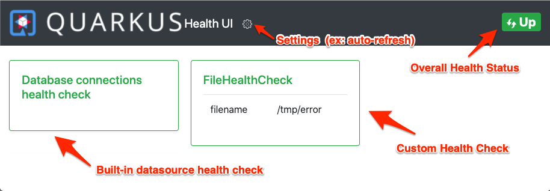

# quarkus-kube-health project

This project demonstrates:
* Custom health check
* Built-in health check (datasource - H2 in-memory databases).
Note, there is no database activity in this example,
only the health status of the
internal H2 datasource, which will always be green.
* Health check probe configuration using application.properties.
This generates the appropriate deployment YAML in target/kubernetes/*.yml files.
* Built-in health web UI that shows health status. A nice developer aid.

## Prerequisites

* Quarkus 999-SNAPSHOT (health-ui is only in master right now)
* minikube 1.11.0 or later (because that's the version I've tested)
* JDK 11 (because that's the version I've tested)
* Maven 3.6.2+

## Instructions

Deploy the application:

```
mvn \
   clean \
   install \
   -DskipTests \
   -Dquarkus.kubernetes.deploy=true
```

Access the endpoint to verify successful deployment:

```
MINIKUBE_IP=`minikube ip`
NODEPORT=`kubectl get svc quarkus-kube-health -o jsonpath='{.spec.ports[0].nodePort}'`

curl http://$MINIKUBE_IP:$NODEPORT/hello
```

Output:
```
hello
```

Connect to health-ui:
```
echo http://$MINIKUBE_IP:$NODEPORT/health-ui
```

Open the output of the `echo http://$MINIKUBE_IP:$NODEPORT/health-ui` command in the browser. This should show similar output to:



In the Health UI, click on the settings icon and set polling interval to 5 seconds.

Connect to the health endpoint for JSON-formatted output. 

```
curl -i http://$MINIKUBE_IP:$NODEPORT/health
```

Output should be similar to:
```
HTTP/1.1 200 OK
content-type: application/json; charset=UTF-8
content-length: 315


{
    "status": "UP",
    "checks": [
        {
            "name": "FileHealthCheck",
            "status": "UP",
            "data": {
                "filename": "/tmp/error"
            }
        },
        {
            "name": "Database connections health check",
            "status": "UP"
        }
    ]
}
```

Log in to the container

```
PODNAME=`kubectl get pods -l app.kubernetes.io/name=quarkus-kube-health  -o jsonpath='{range .items[*]}{@.metadata.name}'`

kubectl exec -it $PODNAME /bin/sh
```
Touch `touch /tmp/error` to kill and restart the pod.
Because the Kubernetes probe settings have been customized in application.properties,
the pod should fail and restart quickly:

```
touch /tmp/error
# Wait a few seconds and the connection should close
```

When the connection dies the UI should show the service being _DOWN_.
Once the service is back up, the health-UI showld show a status of  _UP_.